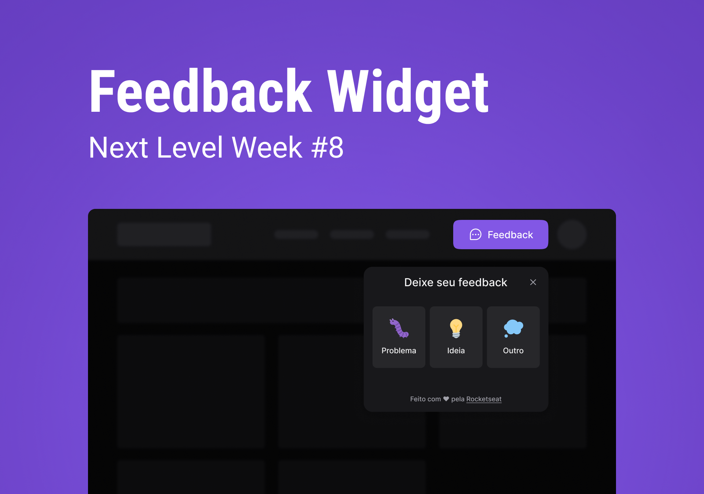

# Next Level Week - Feedback Widget 

⚙️ **Tecnologias utilizadas / Used Technologies**
 
- [Typescript](https://www.typescriptlang.org/)
- [ReactJS](https://reactjs.org/)
- [TailwindCSS](https://tailwindcss.com/)
- [HeadlessUI](https://headlessui.dev/)
- [Prisma](https://www.prisma.io/)
- [Express](https://expressjs.com/)
- [Node.js](https://nodejs.org/en/)
- [SQLite](https://www.sqlite.org/index.html)
- [Jest](https://jestjs.io/)

----------------------------------------------------------------------------------------------------------

🚀 **Como rodar o projeto / Running the project**

Rode o front-end na pasta ( Run the frontend on the folder ) `/web` com ( with ) `npm run dev`

Rode o back-end na pasta ( Run the frontend on the folder ) `/server` com ( with ) `npm run dev`

----------------------------------------------------------------------------------------------------------

🧑🏾‍💻 **Autor / Author**

**Matheus Gomes de Souza**

LinkedIn: https://www.linkedin.com/in/matheus-gomes-de-souza/  
E-mail: matheusg_souza@outlook.com